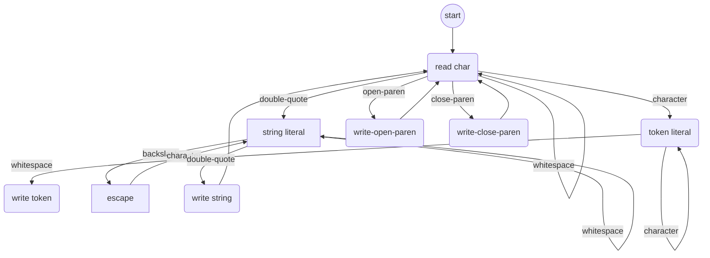

# Minimalisp

A minimal LISP/Scheme for pedagogical purposes.

## Rationale

[XKCD: LISP cycles](https://www.explainxkcd.com/wiki/index.php/297:_Lisp_Cycles)

I once read someone opine that writing a LISP interpreter was like a Jedi apprentice building their own lightsabre - the last part of your apprenticeship before you graduated to become a Jedi Knight.

Unfortunately a brief Internet search turns up nothing canonical, so I'll have to leave the XKCD as my only reference.

Nevertheless, LISP can be a suitably simple and manageable target language for an interpreter project. Why not a compiler, you ask? Because macros require an interpreter, so even a compiler will have to interpret.

Implementations are in language-focussed folders:

* [Nim](nim)
* [Node.js](nodejs)

# Specification

A basic specification of the minimal LISP language, defined using [EBNF](https://en.wikipedia.org/wiki/Extended_Backus%E2%80%93Naur_form).

lowercase-letter = "a" | "b" | "c" | "d" | "e" | "f" | "g" | "h" | "i" | "j" | "k" | "l" | "m" | "n" | "o" | "p" | "q" | "r" | "s" | "t" | "u" | "v" | "w" | "x" | "y" | "z";
uppercase-letter = "A" | "B" | "C" | "D" | "E" | "F" | "G" | "H" | "I" | "J" | "K" | "L" | "M" | "N" | "O" | "P" | "Q" | "R" | "S" | "T" | "U" | "V" | "W" | "X" | "Y" | "Z";
letter = lowercase-letter | uppercase-letter;

digit-excluding-zero = "1" | "2" | "3" | "4" | "5" | "6" | "7" | "8" | "9";
digit = "0" | digit-excluding-zero;
other-character = "!" | "@" | "#" | "$" | "%" | "^" | "&" | "*" | "_" | "=" | "+" | "\" | "|" | "[" | "]" | "{" | "}" | ":" | ";" | "'" | "<" | ">" | "," | "." | "?" | "/";
double-quote = ? ASCII 34 ?;
character = letter | digit | other-character;
any-character = character | "-" | double-quote;

space = ? ASCII 32 ?;
tab = ? ASCII 11 ?;
newline = ? ASCII 13 ?;
whitespace-character = space | tab | newline;
whitespace = whitespace-character, {whitespace-character};

escaped-quote = "\", double-quote;
string-literal = double-quote, {character | escaped-quote | minus}, double-quote;

sign = "+" | "-";
natural-number = digit-excluding-zero, {digit};
integer = ["-"], natural-number;
fractional-part = ".", natural-number;
exponent-part = "e", [sign], natural-number;
numeric-literal = integer, [fractional-part], [exponent-part];

identifier = letter | other-character, {character | "-"};

atom = numeric-literal | string-literal | identifier;

expression = empty-list | non-empty-expression
empty-list = "(", ")";
non-empty-expression = "(", [whitespace], atom | expression, {whitespace, atom | expression}, [whitespace], ")";

## The string problem

In LISP, a program is a string. Atoms and expressions are delimited by whitespace.
Strings are delimited by double-quotes, _but may contain whitespace_. This means that there are two 'modes' of input parsing for a LISP lexxer, that of parsing 'normal' input, and parsing a string. For example, the program:

    The cat sat (on the) mat

is parsed as the list:

    ['The', 'cat', 'sat', ['on', 'the'], 'mat']

but the program:

    Spot went "bark bark"

is parsed as the list:

    ['Spot', 'went', 'bark bark']

but, crucially, not:

    ['Spot', 'went', '"bark', 'bark"']

This form of dual-mode parsing means a more complicated solution than just doing String.splitWhitespace in order to turn the input program into tokens.

One solution would be to parse character by character, and create a sequence as we go by using a Finite State Automata. This writes 'tokens' (actually just string slices, more proto-tokens) to a list by dividing the input stream into:

a) string literals delimited by double-quotes;
b) open parens;
c) close-parens;
b) other tokens delimited by whitespace.

### State machine diagram

### State transition table

| First Header  | Second Header |
| ------------- | ------------- |
| Content Cell  | Content Cell  |
| Content Cell  | Content Cell  |

# License

CC-BY-NC-SA 4.0 - see [LICENSE](./LICENSE) file.
